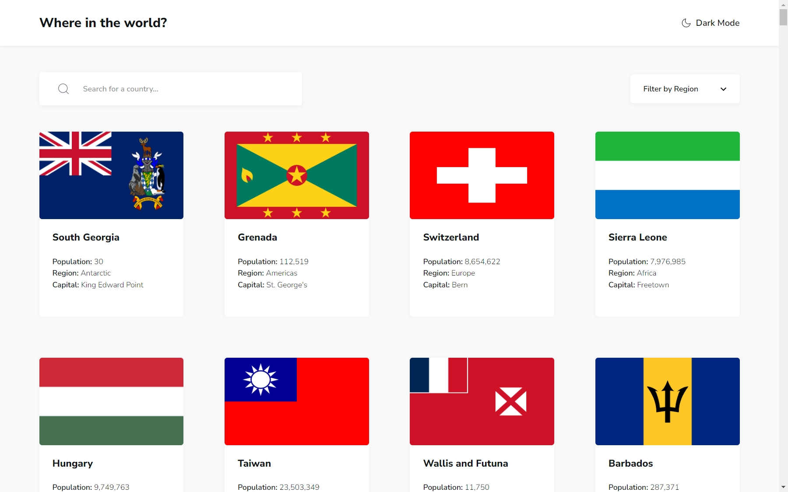

# Frontend Mentor - REST Countries API with color theme switcher solution

This is a solution to the [REST Countries API with color theme switcher challenge on Frontend Mentor](https://www.frontendmentor.io/challenges/rest-countries-api-with-color-theme-switcher-5cacc469fec04111f7b848ca).

## Table of contents

- [Overview](#overview)
  - [The challenge](#the-challenge)
  - [Screenshot](#screenshot)
  - [Links](#links)
- [My process](#my-process)
  - [Built with](#built-with)
  - [What I learned](#what-i-learned)
- [Author](#author)

## Overview

### The challenge

Users should be able to:

- See all countries from the API on the homepage
- Search for a country using an `input` field
- Filter countries by region
- Click on a country to see more detailed information on a separate page
- Click through to the border countries on the detail page
- Toggle the color scheme between light and dark mode _(optional)_

### Screenshot



### Links

- Solution URL: [Github](https://github.com/kaamiik/fm-Rest-Countries-Api-using-React-Tailwind)
- Live Site URL: [Vercel preview](https://fm-rest-countries-api-using-react-tailwind.vercel.app/)

## My process

### Built with

- Semantic HTML5 markup
- Flexbox
- CSS Grid
- Tailwind
- Mobile-first workflow
- [React](https://reactjs.org/) - JS library
- React Router
- Fetch API

### What I learned

During this project, I gained valuable insights into several key React and web development concepts:

1. **URL-Based State Management**

   - Implemented URL parameters using `useSearchParams` for search and filter states
   - Learned about maintaining application state in the URL for better user experience
   - Created shareable and bookmarkable filtered views

   ```javascript
   const [searchParams, setSearchParams] = useSearchParams();
   // Reading from URL: /?search=united&regionFilter=Europe
   const searchTerm = searchParams.get('search');
   const selectedRegion = searchParams.get('regionFilter');
   ```

2. **React Router Navigation**

   - Implemented dynamic routing with URL parameters for country details
   - Mastered the use of `useNavigate` hook for programmatic navigation
   - Integrated search parameters with router functionality

   ```javascript
   const navigate = useNavigate();
   // Using navigate(-1) for back functionality
   <button onClick={() => navigate(-1)}>← Back</button>;
   ```

3. **API Data Fetching Patterns**

   - Implemented efficient data fetching using SWR
   - Learned about handling dependent API calls (border countries)
   - Managed loading and error states for better UX

   ```javascript
   const { data: borderCountries } = useSWR(
     () =>
       borders?.length > 0
         ? `https://restcountries.com/v3.1/alpha?codes=${borders.join(',')}`
         : null,
     fetcher
   );
   ```

4. **Dark Mode Implementation**

   - Successfully implemented theme switching with Tailwind CSS
   - Learned about persisting user preferences using localStorage
   - Managed theme-related state across components

5. **React Aria Components**

   - Implemented accessible select components using React Aria
   - Learned about proper ARIA attributes and roles
   - Enhanced keyboard navigation and screen reader support

6. **Performance and User Experience**
   - Implemented lazy loading for images
   - Created reusable components for better code organization
   - Enhanced user experience with URL-based state persistence
   - Enabled sharing and bookmarking of filtered views

These learnings have significantly improved my understanding of React best practices and modern web development patterns.

## Author

- Frontend Mentor - [@kaamiik](https://www.frontendmentor.io/profile/kaamiik)
- X - [@kiaakamran](https://www.x.com/kiaakamran)
